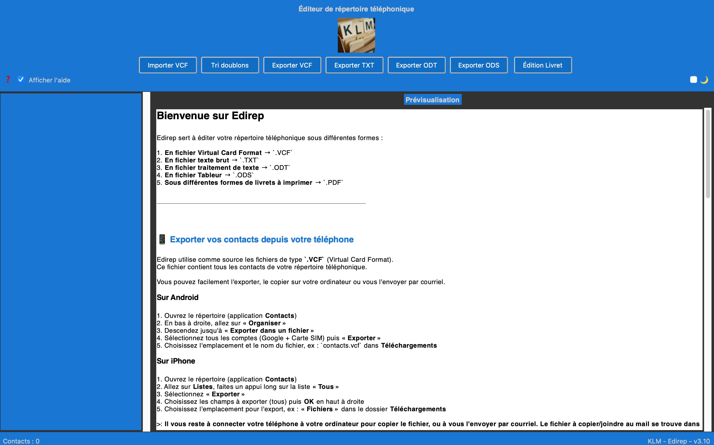
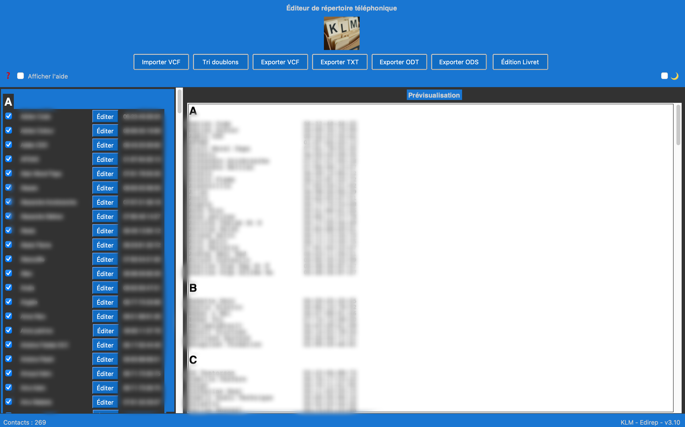
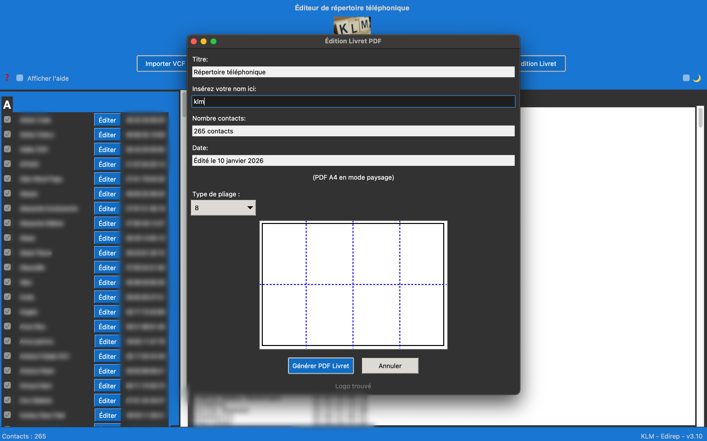
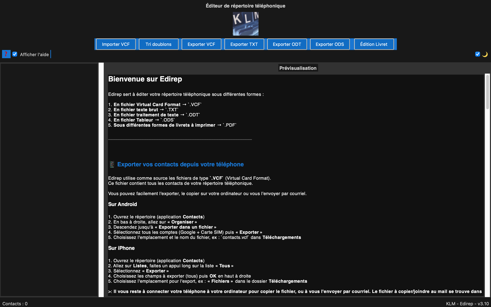

# EDIREP


Edirep sert à éditer votre répertoire téléphonique sous différentes formes.

On importe un fichier `.VCF` depuis un téléphone, on l'édite si besoin et on l'exporte :

1. **En fichier Virtual Card Format** → `.VCF`
2. **En fichier texte brut** → `.TXT`
3. **En fichier traitement de texte** → `.ODT`
4. **En fichier Tableur** → `.ODS`
5. **Sous différentes formes de livrets à imprimer** → `.PDF`

---

## Aperçu







---

## 📥 Téléchargement

### Applications standalone (recommandé pour utilisateurs)

- **macOS** : [Edirep-v3.10.-.macOS.-.x86_64.dmg](https://github.com/mrklm/edirep/releases)
- **Ubuntu/Linux** : 
- **Windows** : _(à venir)_

#### Instructions Ubuntu/Linux après téléchargement :

1. Extrayez l'archive
2. Rendez le fichier exécutable :
```bash
   chmod +x edirep
```
3. Lancez :
```bash
   ./edirep
```

**Prérequis** : Si le programme ne se lance pas, installez :
```bash
sudo apt install python3-tk
```

---

## 🚀 Installation

### Option 1 : Applications standalone (recommandé)
Téléchargez la version correspondante à votre système d'exploitation :
- **macOS** : [Edirep-macOS-v3.8.1.zip](#) 
- **Windows** : _(à venir)_
- **Linux** : Voir installation depuis les sources ci-dessous

### Option 2 : Installation depuis les sources

1. **Clonez ce dépôt** :
```bash
   git clone https://github.com/mrklm/edirep.git
   cd codes
```

2. **Créez un environnement virtuel et installez les dépendances** :
   
   **Sur macOS/Linux** :
```bash
   python3 -m venv venv
   source venv/bin/activate
   pip install reportlab python-docx odfpy
```
   
   **Sur Windows** :
```bash
   python -m venv venv
   venv\Scripts\activate
   pip install reportlab python-docx odfpy
```

3. **Lancez le programme** :
```bash
   python3 edirep.py
```

## 📜 Licence

Ce logiciel est distribué sous la **[GNU General Public License v3.0](LICENSE)**.

Vous êtes libre de :
- ✅ Utiliser ce logiciel à toute fin (y compris commerciale)
- ✅ Étudier et modifier le code source
- ✅ Redistribuer le logiciel
- ✅ Redistribuer vos modifications

**À condition de** :
- 📝 Conserver la même licence GPL v3
- 📝 Rendre le code source disponible
- 📝 Documenter vos modifications

Pour plus de détails, consultez le fichier [LICENSE](LICENSE).
---

## 🛠️ Contribuer

Les contributions sont les bienvenues ! Pour contribuer :

1. Forkez ce dépôt.
2. Créez une branche pour votre fonctionnalité ou correction.
3. Ouvrez une *Pull Request* en expliquant vos modifications.

---

## ⚠️ Avertissement

Ce logiciel est fourni **sans garantie**. L'auteur décline toute responsabilité en cas de dommage ou de dysfonctionnement.

---

## 💡 Pourquoi ce projet est-il sous licence libre ?

Ce projet s'inscrit dans la philosophie du logiciel libre, promue par des associations comme [April](https://www.april.org/). Nous croyons que le partage des connaissances et des outils est essentiel pour une société numérique plus juste et transparente.

---

## 📬 Contact

Pour toute question ou demande d'autorisation (notamment pour un usage commercial), vous pouvez me contacter à l'adresse suivante :

**clementmorel@free.fr**

---

**✨ Bonne édition de répertoire avec Edirep !**
